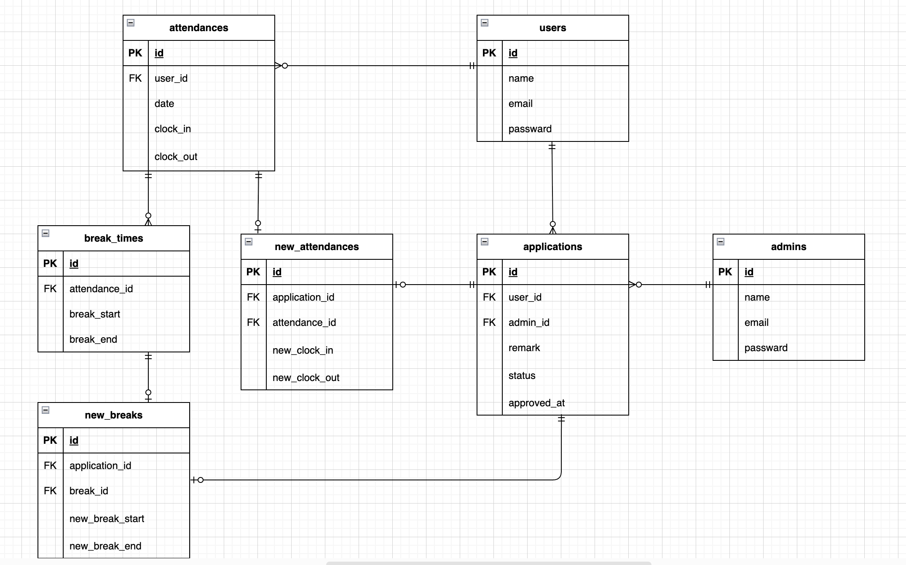

# laravel-attendance（模擬案件２）

## アプリ概要
スタッフの勤怠（出勤・退勤・休憩）を記録し、一般ユーザーの修正申請→管理者承認が行えるアプリケーションです。
CSV出力、メール認証(Mailtrap)、管理者による直接修正等を実装しています。

## 環境構築

### Dockerビルド

1.`git clone git@github.com:yui-0509/laravel-attendance.git` 

2.docker-compose.ymlのmysqlとphpmyadminに`platform:linux/x86_64`を追加

3.DockerDesktopアプリを立ち上げる

4.`docker-compose up -d --build` 

### Laravel環境構築

1.`docker-compose exec php bash` 

2.`composer install` 

3..env.exampleファイルを基に.envファイルを作成し、下記環境変数を変更 

```bash
cp .env.example .env
```

```env
DB_CONNECTION=mysql
DB_HOST=mysql
DB_PORT=3306
DB_DATABASE=laravel_db
DB_USERNAME=laravel_user
DB_PASSWORD=laravel_pass
```

4.アプリケーションキーの作成 

   `php artisan key:generate` 

5.マイグレーションの実行 

   `php artisan migrate` 

6.シーディングの実行. 

   `php artisan db:seed` を実行することで、以下のダミーデータが登録されます。

- 管理者（１名）</br>
  email:admin@example.com</br>
  password:password123
- 一般ユーザー（６名）</br>
  name:西 伶奈</br>
  email:reina.n@coachtech.com</br>
  name:山田 太郎</br>
  email:taro.y@coachtech.com</br>
  name:増田 一世</br>
  email:issei.m@coachtech.com</br>
  name:山本 敬吉</br>
  email:keikichi.y@coachtech.com</br>
  name:秋田 朋美</br>
  email:tomomi.a@coachtech.com</br>
  name:中西 教夫</br>
  email:norio.n@coachtech.com</br>
  パスワードは全員共通で`password123`です。
- 勤怠・休憩データ（上記一般ユーザー６名分×３ヶ月分）

### メール送信確認(Mailtrap)
ローカル環境でメール送信を確認するためにMailtrapを使用しています。

.env設定
```env
MAIL_MAILER=smtp
MAIL_HOST=sandbox.smtp.mailtrap.io
MAIL_PORT=2525
MAIL_USERNAME=（MailtrapのUsername）
MAIL_PASSWORD=（MailtrapのPassword）
MAIL_ENCRYPTION=tls
MAIL_FROM_ADDRESS=no-reply@example.com
MAIL_FROM_NAME="${APP_NAME}"
```

ユーザー登録後、認証メールが送信されます。メール本文内の「Verify Email Address」をクリックすると勤怠登録画面に遷移します。

### 使用技術（実行環境）

- php 8.1
- Laravel　8.75
- MySQL 8.0.26
- nginx 1.21.1
- フロントエンド　Blade,CSS,JavaScript
- 開発環境　Docker
- 認証　Laravel Fortify
- 言語　PHP

### ER図

 

### URL

- 開発環境：http://localhost/
- ユーザー登録：http://localhost/register
- 管理者ログイン：http://localhost/admin/login
- phpMyAdmin：http://localhost:8080/
